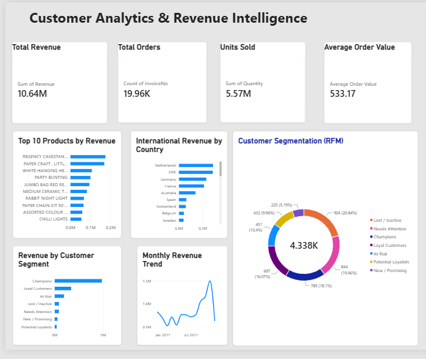
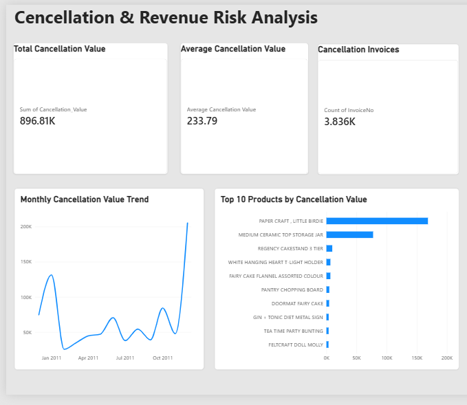

# Customer Analytics & Revenue Intelligence

## Project Overview

An end-to-end retail analytics project using Python, SQL-style data transformations, and Power BI to analyze revenue performance, customer purchasing behavior, RFM customer segments, and cancellation risks.

The project transforms raw transaction data into actionable business insights through data cleaning, exploratory analysis, customer segmentation, and interactive dashboards.

## Tools & Technologies

- Python (Pandas, NumPy)
- Jupyter Notebook
- Power BI
- DAX
- Excel / CSV
- VS Code

## Dataset

**Source:** UCI Machine Learning Repository — Online Retail Dataset

- Original transactions: 541,909
- Period: December 2010 – December 2011
- Identified customers: 4,338
- Data includes invoices, products, quantities, prices, customers, and countries.

## Data Preparation

- Removed duplicate transactions.
- Excluded cancelled invoices from positive sales analysis.
- Filtered invalid quantities and prices.
- Calculated transaction-level revenue.
- Prepared aggregated datasets for Power BI reporting.
- Analyzed cancellation transactions separately.

## Key Performance Indicators

| Metric | Value |
|---|---:|
| Total Revenue | $10.64M |
| Total Orders | 19,960 |
| Units Sold | 5.57M |
| Average Order Value | $533.17 |
| Cancellation Value | $896.81K |
| Cancellation Invoices | 3,836 |
| Average Cancellation Value | $233.79 |

## Customer Segmentation (RFM)

Customers were segmented using Recency, Frequency, and Monetary analysis.

| Segment | Customers |
|---|---:|
| Champions | 785 |
| Loyal Customers | 697 |
| At Risk | 451 |
| Lost / Inactive | 904 |
| Needs Attention | 844 |
| Potential Loyalists | 432 |
| New / Promising | 225 |

Champions and Loyal Customers represent approximately **34.16% of identified customers** but contribute **73.92% of identified-customer revenue**.

## Business Insights

1. The United Kingdom accounts for approximately 84.59% of positive sales revenue.
2. Champions and Loyal Customers are the primary drivers of identified-customer revenue.
3. November 2011 was the strongest complete month for revenue.
4. December 2011 contains only partial-month data and should not be compared directly with full months.
5. Cancellation values highlight potential revenue risks, but do not represent a verified product return rate.

## Power BI Dashboards

### Executive Overview

Includes revenue KPIs, monthly trends, top-selling products, international revenue, and RFM customer segmentation.

### Cancellation & Revenue Risk Analysis

Includes cancellation KPIs, monthly cancellation trends, and the top 10 merchandise products by cancellation value.

## Project Files

- `01_customer_analytics.ipynb` — Python data preparation and analysis
- `Customer_Analytics_Revenue_Intelligence.pbix` — Power BI report
- `screenshots/` — Dashboard screenshots
- `README.md` — Project documentation

## Business Recommendations

- Prioritize retention initiatives for high-value Champions and Loyal Customers.
- Develop re-engagement campaigns for At Risk and Lost / Inactive customers.
- Investigate high-value cancellation outliers to identify potential operational issues.
- Monitor monthly revenue and cancellation trends for business planning.

## Data Source

UCI Machine Learning Repository: Online Retail Dataset.

## Project Purpose

This portfolio project demonstrates practical skills in data cleaning, business analytics, customer segmentation, KPI reporting, data visualization, and translating transactional data into business recommendations.
## Power BI Dashboard Screenshots

### Executive Overview

### Cancellation Analysis

